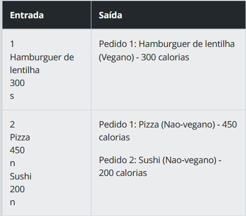
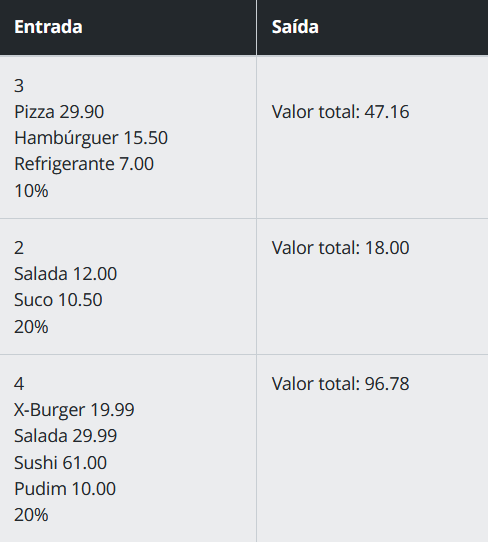

<h1 align="center">Exercite sua Lógica com Desafios de Código em JavaScript</h1>

## Desafio 01: Tempo Estimado de Entrega

- <strong>Descrição:</strong> Imagine que você está criando um aplicativo de entrega de comida e precisa informar ao usuário o tempo estimado de entrega de um restaurante. A mensagem deve conter o nome do restaurante e o tempo estimado de entrega em minutos.

- <strong>Entrada:</strong> A entrada deverá receber os valores abaixo:

  - nomeRestaurante (string): o nome do restaurante desejado.
  - tempoEstimadoEntrega (number): o tempo estimado de entrega em minutos.

- <strong>Saída:</strong> Deverá retornar uma mensagem (string) informando ao usuário o tempo estimado de entrega do restaurante. Por exemplo, para o restaurante Bar do Zinho com o tempo estimado de entrega sendo 20, imprima: "O restaurante Bar do Zinho entrega em 20 minutos."

- <strong>Desafio Bônus:</strong> Utilize interpolação de strings para formatar sua saída ao invés da concatenação de strings tradicional.

- <strong>Exemplos:</strong> A tabela abaixo contém exemplos com alguns dados de entrada e suas respectivas saídas esperadas.
  
  
  

### Você pode acessar o código deste desafio clicando [neste link]()

## Desafio 02: Calcular o Preço final de um Pedido

- <strong>Descrição:</strong> Você está criando um aplicativo de entrega de comida e precisa calcular o preço final do pedido do usuário. O usuário escolheu alguns itens do cardápio e é preciso calcular o preço total do pedido.

- <strong>Entrada:</strong> A entrada deverá receber os valores abaixo:

  - valorHamburguer: o valor unitário de um hambúrguer.
  - quantidadeHamburguer: a quantidade de hambúrgueres que o usuário deseja.
  - valorBebida: o valor unitário de uma bebida.
  - quantidadeBebida: a quantidade de bebidas que o usuário deseja.
  - valorPago: o valor pago pelo usuário.

- <strong>Saída:</strong> A saída deve retornar um texto informando o valor total do pedido e a quantidade de troco que será necessário.

- <strong>Exemplos:</strong> A tabela abaixo contém exemplos com alguns dados de entrada e suas respectivas saídas esperadas. 
  
  

### Você pode acessar o código deste desafio clicando [neste link]()

## Desafio 03: Ganhe uma Sobremesa Grátis!

- <strong>Descrição:</strong> Crie um programa que informe ao usuário se ele pode receber um brinde especial de acordo com o valor total do pedido. Se o valor total do pedido for maior ou igual a R$ 50.00, o usuário receberá uma sobremesa grátis. Caso contrário, o usuário não receberá nenhum brinde.

- <strong>Entrada:</strong> A entrada deverá receber o valor total do pedido em uma variável numérica:

  - valorPedido: o valor do pedido.

- <strong>Saída:</strong> Deverá retornar uma mensagem (string) que informa se o usuário ganhou uma sobremesa ou não:
  - Se valorPedido >= 50, a mensagem deve ser:
"Parabéns, você ganhou uma sobremesa grátis!"
  - Caso contrário, a mensagem deve ser:
"Que pena, você não ganhou nenhum brinde especial."

- <strong>Exemplos:</strong> A tabela abaixo contém exemplos com alguns dados de entrada e suas respectivas saídas esperadas. 
  
  

### V pode acessar o código deste desafio clicando [neste link]()

## Desafio 04: Identificando Pedidos Veganos

- <strong>Descrição:</strong> O objetivo deste programa é ajudar a equipe do Restaurante Veggieworld a identificar rapidamente os pedidos veganos e não veganos e informar as calorias de cada prato definido pelo cliente. O programa deve solicitar ao usuário o número de pedidos que serão feitos e, em seguida, pedir informações sobre cada pedido, incluindo se o prato é vegano ou não (usando as opções "s" para sim e "n" para não) e a quantidade de calorias. Ao final, o programa deve exibir uma lista de todos os pedidos com suas informações correspondentes.

- <strong>Entrada:</strong> 
  - Um inteiro n, que representa o número de pedidos que o usuário deseja fazer.

  - Para cada pedido, o usuário deve inserir: 
    - O nome do prato;
    - A quantidade de calorias do prato;
    - Se o prato é vegano ou não (usando as opções "s" para sim e "n" para não).

- <strong>Saída:</strong> O programa deve exibir uma lista de todos os pedidos com suas informações correspondentes, incluindo o nome do prato, se é vegano ou não, e a quantidade de calorias, no seguinte formato:
"Pedido X: NOME_DO_PRATO (EH_VEGANO?) - YYY calorias"
  - onde "X" é o número do pedido, "NOME_DO_PRATO" é o nome do prato, "EH_VEGANO?" indica se o prato é vegano (escrever "Vegano" ou "Nao-vegano"), e "YYY" é a quantidade de calorias do prato.

- <strong>Exemplos:</strong> A tabela abaixo contém exemplos com alguns dados de entrada e suas respectivas saídas esperadas. 
  
  

### Você pode acessar o código deste desafio clicando [neste link]()

## Desafio 05: Gerenciamento de Pedidos de Comida Online

- <strong>Descrição:</strong> Você foi contratado para desenvolver um sistema que armazena informações dos pedidos de comida online realizados por um cliente. O sistema deve permitir ao cliente inserir novos pedidos, escolher um cupom de desconto (10% ou 20%) e exibir o valor total de todos os pedidos realizados até o momento, com o desconto aplicado.

- <strong>Entrada:</strong> A entrada é composta por:

  - Uma linha com um número inteiro n representando a quantidade de pedidos que o usuário deseja inserir;
  - n linhas, cada uma contendo uma string com o nome do pedido e um valor em ponto flutuante separados por espaço. O nome do pedido não contém espaços em branco;
  - Uma linha contendo o cupom de desconto escolhido (10% ou 20%).

- <strong>Saída:</strong> O programa deve exibir uma única linha contendo o valor total de todos os pedidos com o desconto aplicado, no seguinte formato: "Valor total: XX.YY"
  - onde "XX.YY" é a soma de todos os pedidos com desconto em formato de duas casas decimais após a vírgula.

- <strong>Exemplos:</strong> A tabela abaixo contém exemplos com alguns dados de entrada e suas respectivas saídas esperadas. 
  
  

### Você pode acessar o código deste desafio clicando [neste link]()

