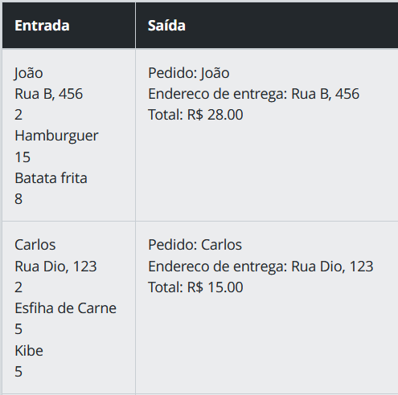
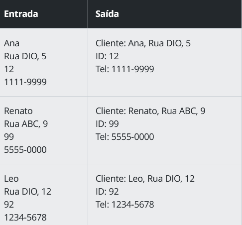
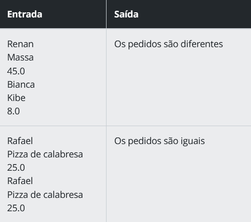
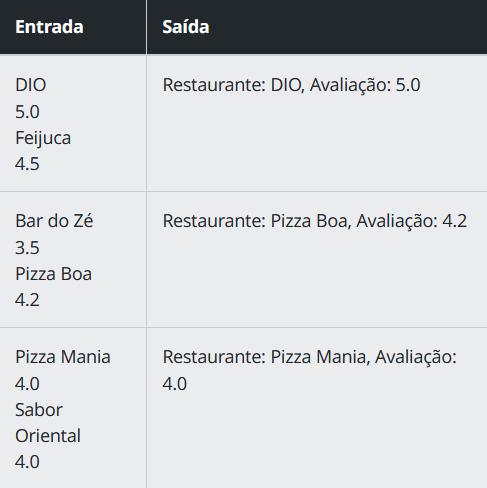
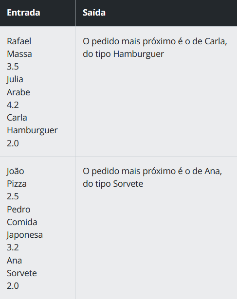

<h1 align="center">Explorando JSON na prática com Desafios de Código</h1>

## Desafio 01: Dio Delivery

- <strong>Descrição:</strong> A empresa DIO Delivery precisa calcular o valor total de um pedido e imprimir na tela as seguintes informações: o nome do cliente, o endereço de entrega e o total do pedido, incluindo a taxa de entrega, fixa de R$ 5.00.

- <strong>Entrada:</strong> Entrada deverá receber os valores que preencherão o objeto JSON , ele deverá conter as seguintes propriedades:

  - cliente: uma string com o nome do cliente.
  - endereco: uma string com o endereço de entrega.
  - quantidade de itens: indica a quantidade de itens que devem ser lidos no array a seguir.
  - itens: um array de objetos que representam um item do pedido, com as seguintes propriedades: 
    - nome(string)
    - preço (number)
     

  Importante: a entrada deverá ocorrer de acordo com a ordem de informações fornecidas acima.

- <strong>Saída:</strong> Deverá retornar uma mensagem (string) que informa o nome do cliente, o endereço de entrega e o total do pedido, da seguinte maneira: 
 
Pedido: pedido.cliente
 
Endereço de entrega: pedido.endereco
 
Total: R$totalCalculado

- <strong>Exemplos:</strong> A tabela abaixo contém exemplos com alguns dados de entrada e suas respectivas saídas esperadas.
  
  
  

### Você pode acessar o código deste desafio clicando [neste link](https://github.com/viviansanchez/dio-potencia-tech-angular-developer-desafios-de-codigo/blob/main/Desafios%20-%20Explorando%20JSON%20na%20Pr%C3%A1tica%20com%20Desafios%20de%20C%C3%B3digo/dio-delivery.js)

## Desafio 02: Acompanhando os Pedidos

- <strong>Descrição:</strong> Imagine que você é um desenvolvedor de uma plataforma de entregas de comida que está trabalhando em um novo recurso que permitirá que os entregadores vejam informações sobre os clientes dos pedidos que devem entregar, incluindo o nome, endereço, ID e número de telefone da pessoa. Sua tarefa é criar um programa em JavaScript que leia os dados de um pedido, que incluem (principalmente) as informações do Cliente. Com os dados de entrada em mãos, seu programa deve apresentá-los em uma tela (Saída) para os entregadores orquestrarem as entregas dos pedidos.

- <strong>Entrada:</strong> A entrada do programa será feita pelo usuário e terá as seguintes informações (propriedades):

  - nome: o nome do cliente, representado por uma string;
  - endereco: endereço do cliente, representado por uma string;
  - id: identificador do pedido do cliente, representado por um valor numérico;
  - telefone: telefone do cliente, representado por uma string; 
     

  Importante: a entrada deverá ocorrer de acordo com a ordem de informações fornecidas acima.

- <strong>Saída:</strong> Deverá retornar uma mensagem (string) que mostre as informações do cliente e do pedido na tela, veja exemplo abaixo: 
 
Cliente: pedido.cliente.nome, pedido.cliente.endereco
 
ID: pedido.id
 
Tel: pedido.cliente.telefone

- <strong>Exemplos:</strong> A tabela abaixo contém exemplos com alguns dados de entrada e suas respectivas saídas esperadas.
  
  
  

### Você pode acessar o código deste desafio clicando [neste link](https://github.com/viviansanchez/dio-potencia-tech-angular-developer-desafios-de-codigo/blob/main/Desafios%20-%20Explorando%20JSON%20na%20Pr%C3%A1tica%20com%20Desafios%20de%20C%C3%B3digo/acompanhando-pedidos.js)

## Desafio 03: Comparando os Pedidos

- <strong>Descrição:</strong> O objetivo desse desafio é criar um programa em JavaScript que compare dois objetos JSON de pedidos de entrega e determine se eles possuem ou não as mesmas informações. O programa deve criar dois objetos JSON contendo o nome do cliente, além do nome e preço de um item selecionado.

- <strong>Entrada:</strong> O programa receberá os dados necessários para criar dois Clientes com seu respectivo Item de Pedido para comparação:
- Cliente 1
    - Nome (string): nome do primeiro cliente.
    - Nome do Item (string): nome do item de pedido selecionado para o primeiro cliente.
    - Preço do Item (number): preço do item de pedido selecionado para o primeiro cliente.

- Cliente 2
    - Nome (string): nome do segundo cliente.
    - Nome do Item (string): nome do item de pedido selecionado para o segundo cliente.
    - Preço do Item (number): preço do item de pedido selecionado para o segundo cliente.
  
     

  Importante: a entrada deverá ocorrer de acordo com a ordem de informações fornecidas acima.

- <strong>Saída:</strong> Se todos os dados dos clientes forem estritamente iguais, o programa deverá retornar a mensagem: 
  - Os pedidos são iguais
 

Caso contrário, o programa deverá retornar a mensagem:
  -  Os pedidos são diferentes

- <strong>Exemplos:</strong> A tabela abaixo contém exemplos com alguns dados de entrada e suas respectivas saídas esperadas.
  
  
  

### Você pode acessar o código deste desafio clicando [neste link](https://github.com/viviansanchez/dio-potencia-tech-angular-developer-desafios-de-codigo/blob/main/Desafios%20-%20Explorando%20JSON%20na%20Pr%C3%A1tica%20com%20Desafios%20de%20C%C3%B3digo/comparando-pedidos.js)

## Desafio 04: Avaliando Restaurantes

- <strong>Descrição:</strong> Você é um desenvolvedor de um aplicativo de delivery de comida muito popular na sua cidade. O aplicativo permite que os usuários encontrem e peçam comida de seus restaurantes favoritos diretamente do conforto de suas casas. Um dos seus colegas de trabalho, que é responsável pela integração de novos restaurantes ao aplicativo, pediu sua ajuda para criar um código que exiba o restaurante com a melhor avaliação em uma página web. Para isso, ele forneceu um array de objetos JSON contendo informações sobre dois restaurantes. Você, como um excelente desenvolvedor, decide ajudar seu colega de trabalho com este desafio e começa a escrever o código necessário para exibir as informações na tela. Seu desafio é criar um código em JavaScript que percorra uma array de dois objetos JSON contendo informações sobre os restaurantes, exibindo o nome e a avaliação do restaurante com a melhor avaliação.

- <strong>Entrada:</strong> A entrada do seu código será os valores (nome e avaliação) dos seus objetos JSON, contendo informações necessárias sobre cada restaurante. Cada objeto terá as seguintes propriedades:

  - nome: o nome do restaurante, representado por uma string;
  - avaliacao: a avaliação média do restaurante, representado por um número de 0 a 5.

- <strong>Saída:</strong> A saída do seu código será o nome e a avaliação do restaurante melhor avaliado. Lembre-se de formatar a avaliação com 1 casa decimal após a virgula, conform o exemplo a seguir: 
 
Restaurante: restaurante.nome, Avaliação: restaurante.avaliacao

- <strong>Exemplos:</strong> A tabela abaixo contém exemplos com alguns dados de entrada e suas respectivas saídas esperadas.
  
  
  
### Você pode acessar o código deste desafio clicando [neste link](https://github.com/viviansanchez/dio-potencia-tech-angular-developer-desafios-de-codigo/blob/main/Desafios%20-%20Explorando%20JSON%20na%20Pr%C3%A1tica%20com%20Desafios%20de%20C%C3%B3digo/avaliando-restaurantes.js)

## Desafio 05: Encontrando o Pedido mais Próximo

- <strong>Descrição:</strong> Um restaurante está buscando otimizar a entrega dos pedidos, e para isso precisa de um programa que encontre o pedido mais próximo a partir de uma lista de pedidos. O programa deve exibir o nome e o tipo de comida do pedido mais próximo. Seu desafio é criar um código em JavaScript que manipule um array com três objetos JSON, contendo as informações de cada pedido (nome, tipo e distância).

- <strong>Entrada:</strong> A entrada consiste em uma lista com 3 pedidos, os quais terão as seguintes propriedades:

  - nome: o nome do cliente, representado por uma string;
  - tipo: o tipo de comida do restaurante, representado por uma string.
  - distancia: a distância em quilometros do pedido até o restaurante, representado por um valor de 0 a 15.

- <strong>Saída:</strong> O programa deve exibir no console um texto contendo o nome do cliente e o tipo do pedido mais próximo encontrado na lista de pedidos. Conforme o exemplo abaixo:
 
O pedido mais próximo é o de pedido.nome, do tipo pedido.tipo

- <strong>Exemplos:</strong> A tabela abaixo contém exemplos com alguns dados de entrada e suas respectivas saídas esperadas.
  
  
  
### Você pode acessar o código deste desafio clicando [neste link](https://github.com/viviansanchez/dio-potencia-tech-angular-developer-desafios-de-codigo/blob/main/Desafios%20-%20Explorando%20JSON%20na%20Pr%C3%A1tica%20com%20Desafios%20de%20C%C3%B3digo/pedido-mais-proximo.js)

